# TSDHN

TSDHN es una aplicación web para la estimación de parámetros de tsunamis de origen lejano mediante simulaciones numéricas. Este proyecto forma parte del Programa de Investigación Científica (PICV 2025) de la Universidad Nacional Mayor de San Marcos.

## Arquitectura

```mermaid
flowchart LR
    subgraph Cliente
        User((👤 Usuario))
        style User fill:#f9f,stroke:#333
    end

    subgraph CapaFrontend["Frontend"]
        direction TB
        Web["🌐 Aplicación web<br/>(Next.js + TypeScript)"]
        style Web fill:#90CAF9,stroke:#1565C0
    end

    subgraph Despliegue["Deploy"]
        CF["☁️ Cloudflare Pages"]
        style CF fill:#F4511E,stroke:#BF360C
    end

    subgraph Backend["Backend"]
        API["⚙️ API REST<br/>(Python)"]
        Model["📊 Modelo numérico<br/>(Fortran)"]
        style API fill:#81C784,stroke:#2E7D32
        style Model fill:#FFB74D,stroke:#EF6C00
    end

    %% Conexiones
    User <--> Web
    Web <--> CF
    CF <--> API
    API <--> Model

    classDef default fill:#fff,stroke:#333,stroke-width:2px
    linkStyle default stroke:#666,stroke-width:2px
```



El sistema está dividido en dos componentes principales que trabajan en conjunto para procesar y visualizar las simulaciones de tsunamis:

El **backend** ([picv-2025](https://github.com/totallynotdavid/picv-2025)) maneja el procesamiento numérico y cálculos, implementado en Python y Fortran. Este componente expone una API REST que procesa las solicitudes y ejecuta las simulaciones necesarias.

El **frontend** ([picv-2025-web](https://github.com/totallynotdavid/picv-2025-web)) proporciona la interfaz de usuario, desarrollada en Next.js y TypeScript. Permite a los usuarios configurar parámetros y visualizar los resultados de las simulaciones.

## Desarrollo

Para comenzar, necesitarás:

- Node.js 20.x (puedes usar [nvm](https://github.com/nvm-sh/nvm?tab=readme-ov-file#installing-and-updating))
- [Git](https://git-scm.com/book/en/v2/Getting-Started-Installing-Git) (opcional, pero recomendado)

### Configuración del entorno

1. Instalar Node.js 20:

```bash
nvm install 20
nvm use 20
```

2. Configurar el proyecto:

```bash
git clone https://github.com/totallynotdavid/picv-2025-web
cd picv-2025-web
npm install
```

### Variables de entorno

Crea un archivo `.env.local` en la carpeta principal del proyecto con las siguientes variables:

| Variable | Desarrollo            | Producción                              |
| -------- | --------------------- | --------------------------------------- |
| API_URL  | http://localhost:8000 | https://api.tsdhn.pages.dev (pendiente) |
| NODE_ENV | development           | production                              |

## Deploy

El sistema utiliza Cloudflare Pages para el frontend y un servidor privado del GI para el backend, conectados mediante Cloudflare Tunnel. La configuración de despliegue es automática y se activa con cada push a la rama principal del repositorio.

Para configurar un nuevo deploy en Cloudflare Pages:

1. Selecciona Next.js como framework preset
2. Establece `npm run build` como `build command`
3. Configura las variables de entorno en el panel de Cloudflare

## Equipo

El desarrollo está a cargo de:

- Cesar Jimenez (Coordinador)
- David Duran ([@totallynotdavid](https://github.com/totallynotdavid))
- David Salles ([@David-Salles](https://github.com/David-Salles))
- Elvis Velasquez ([@elvis-velper](https://github.com/elvis-velper))
